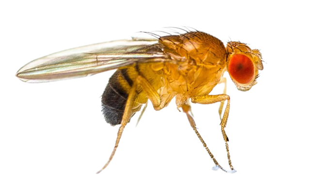

```{r, include=FALSE}
knitr::opts_chunk$set(results = 'asis',
                      echo = FALSE,
                      warning = FALSE,
                      tidy = FALSE,
                      message = FALSE,
                      fig.align = 'center',
                      out.width = "100%")
options(knitr.table.format = "html")

```


<style>

.main {
font-family: "Comic Sans MS";
}

body {
margin: 2cm;
}

.column {
float: right;
padding: 1cm;
}

.main p {
padding-top: 5%;
font-size: $if(main_textsize)$$main_textsize$$else$170px$endif$;
text-align: left;
}

</style>

<br>

<center>

</center>
<p align = "center"> *Drosophila melanogaster*</p>

<br>

We are offering the opportunity for outstanding students to get involved in research projects starting in `r colorize("Fall 2022", "orange")`. `r emo::ji("science")``r emo::ji("scientist")`

<br>

Our lab examines the coevolution of foraging behavior and the life history of fruit flies. Specifically, we analyze the frequencie of alleles with underlying effects on the foraging behavior of individuals evolving under different `r colorize("selective preasures", "orange")` in the laboratory, which enables one to make strong inferences concerning `r colorize("phenotypic and genetic", "orange")` responses to `r colorize("selection", "orange")`.

<br>

The main roles of students will include:

- Maintenance of populations of fruit flies in the laboratory. `r emo::ji("bug")`

- Design of experimental studies followed by the application of statistical analyses. `r emo::ji("stats")` `r icons::fontawesome("r-project")`

- Data gathering of energy acquisition in larvae. `r emo::ji("computer")`

<br>

If you are interested in working with us, please feel free to reach out at dpadil10@asu.edu `r emo::ji("email")`
